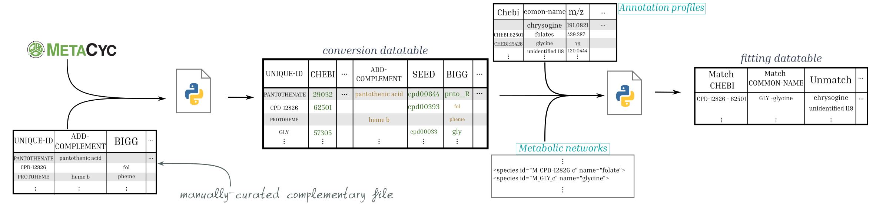

Overview
========

General description
-------------------

[MetaNetMap](https://github.com/coraliemuller/metanetmap) is a Python tool dedicated to mapping metabolite information between metabolomic data and metabolic networks.
The goal is to facilitate the identification of metabolites from **metabolomics data** that are also present in one or more **metabolic networks**, taking into consideration that data from the former has distinct identifier from the latter.

Some metabolites can be rather easily identifiable using intermediate well-known identifiers, whereas for others, mapping is more difficult and may require partial matching. The picture below summarises the mapping procedure implemented in MetaNetMap. 

Why using this tool to map metabolomic data?
--------------------------------------------

- **ID variability in metabolic networks:**  
  Automatic reconstruction of metabolic networks using different tools often assigns different IDs to the same metabolites. It is likely that those do not match the nomenclature of metabolomic annotations. To reconcile them, metadata from metabolic networks associating molecules to alternative databases can be used, so can third-party external databases such as [https://www.metanetx.org](MetaNetX). MetaNetMap provides such functionalities. 

- **Metabolomic data complexity:**  
  Due to the difficulty of annotating metabolomic profiles, identifications are often partial, incomplete, and inconsistently represented. For example, enantiomers are frequently not precisely specified because they are indistinguishable by LC/MS methods. Matching must account for this.

MetaNetMap can match one or several metabolomic annotation tables to one or several metabolic networks. 

Third-party database for matching
---------------------------------

In case metadata from metabolic network do not match identifiers of the metabolomic data, a third-party database, referred to as *conversion_datatable* file acts as a bridge between the metabolomics data and the metabolic networks.  

MetaNetMap enables the construction of such resource using MetaNetX or MetaCyc knowledge bases. In the former case, data from ``chem_xref.tsv`` and ``chem_prop.tsv`` MetaNetX files is used. In the latter case (requires a licence), metadata from the ``compounds.dat`` file is extracted. Additionally, users can provide another table with existing mapping data, referred to as *datatable_complementary*.
  
The resulting table serves as a comprehensive knowledge base that allows MetaNetMap to search across all known identifiers for a given metabolite and match them between the input data and the metabolic networks.  

Refer to the documentation to build your first mapping table, using MetaNetX data.

.. note::
   The ``test`` commands of MetaNetMap rely on MetaCyc database.  
   However, complete information from MetaCyc related to the ontology of metabolites and pathways is **not included** in the test option because of licensing restrictions.  
   Only a simplified example (a "toy" version) of the ``datatable_conversion`` file is provided.

After building this knowledge base - ``datatable_conversion``, it is possible to perform mapping in several ways

- **Classic mode**:
The classic mode allows you to input one metabolomic data file or a directory containing several of them, and a unique metabolic network.

- **Community mode**:
The "community" mode allows you to input a directory containing one or several metabolomic data files, as well as a directory containing multiple metabolic networks.

- **Partial match (Option for mode classic and community)**:
The **partial match** is optional, as it can be time-consuming. It is a post-processing step applied to metabolites or IDs that were not successfully mapped during the initial run. These unmatched entries are re-evaluated using specific strategies, which increase the chances of finding a match (e.g., via CHEBI, INCHIKEY, or enantiomer simplification).

More details in `_Application_details`_ section.

License
-------

GNU Lesser General Public License v3 (LGPLv3)

Authors
-------

Coralie Muller, `Sylvain Prigent <https://bfp.bordeaux-aquitaine.hub.inrae.fr/personnel/pages-web-personnelles/prigent-sylvain>`__  and `Clémence Frioux <https://cfrioux.github.io>`__ -- `Inria Pleiade team <https://team.inria.fr/pleiade/>`__
